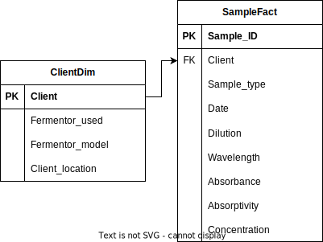

# Colorifix Technical Task

The goal of this technical test is to build a data pipeline that performs the following:
1. Access a remote data table containing fermentation data produced in dye houses using Colorifix's technology. The data should be accessed via a public API.
2. Calibrate a Beer-Lambert model to find the pigment concentration from absorbance data.
3. Collect absorbance data from 1. to calculate pigment concentrations for each data record using the model in 2.
4. Load the results into a structured dtabase and/or provide plots.

# Setup
1. clone the git repo
```
git clone https://github.com/EcoFiendly/colorifix_test.git
cd colorifix_test
```

2. create a .env file in the directory and store the token and database id in there in this format
```
API_TOKEN = your token here
```

3. make sure to have pipenv installed then run
```
pipenv install
```

4. run this command from root of directory
```
python src/main.py
```

5. the script will populate data/ and results/. It will also print the output file names and the mean concentration of the sample in the file. 

# Background
Beer-Lambert equation can be used to determine the relationship between absorbance (A) and concentration (c):
```
A = E c l
```
E is the absorptivity coefficient and l is optical path length in cm.
Assume when measuring multiple chemicals their absorbances can be added such that for N chemicals, A is the sum of absorbance of each of the chemicals. When measuring a sample in the spectrophotometer (chemical in a solvent), we also measure the solvent only (i.e. no pigment) and call this a Blank.

# Thought process
1. for calibration data:
    1. since A = E c l and l = 1cm, equation can be written as A = E c
    2. using the calibration data, and having A and c, equation can be rewritten as E = A/c
    3. to obtain A(pigment), I need to first subtract A(blank) from A(total)
    3. plug in A(pigment) and c from calibration data and get E
2. Taking the E from calibration and calculating concentration for each of the samples:
    1. we now need to find c, equation can be rewritten as c = A/E
    2. once again need to subtract A(blank) from A(total)
    3. plug in A(pigment) and E to get c

# Data model


Data model of dye samples.

# If I had more time
1. I think I might not have grasped the concept fully, specifically this part in the instruction: "Absorbance is a function of wavelength. When calibrating the Lambert-Beer model, work with a single wavelength instead of considering the whole range. Make sure to justify your decision."// I went for a generalised approach to begin with, and used mean for my calculations.
2. I also did not include std errors when doing my calculations (which I remember from class is important).
3. Data model diagram.
4. Load the data into a database instead of writing to csv files. Or populate a notion page/database with the data, I assume that is how it works at Colorifix
5. Could implement an ELT pipeline instead where the raw data is loaded into a db, then transformations applied to it to obtain the desired outcome.
6. Implement tests for my code.
7. Implement logging, will aid in debugging and monitoring health of data pipeline in production.
8. Dockerise the project, one step further than dependency management, will ensure code runs between machines running different operating systems.

# Final thoughts
1. I think this task is too big for 5 hours, I struggled to put it together, and have had to make the decision to do less of the code side of things and instead apply more of the theory in order to get concentrations calculationed.